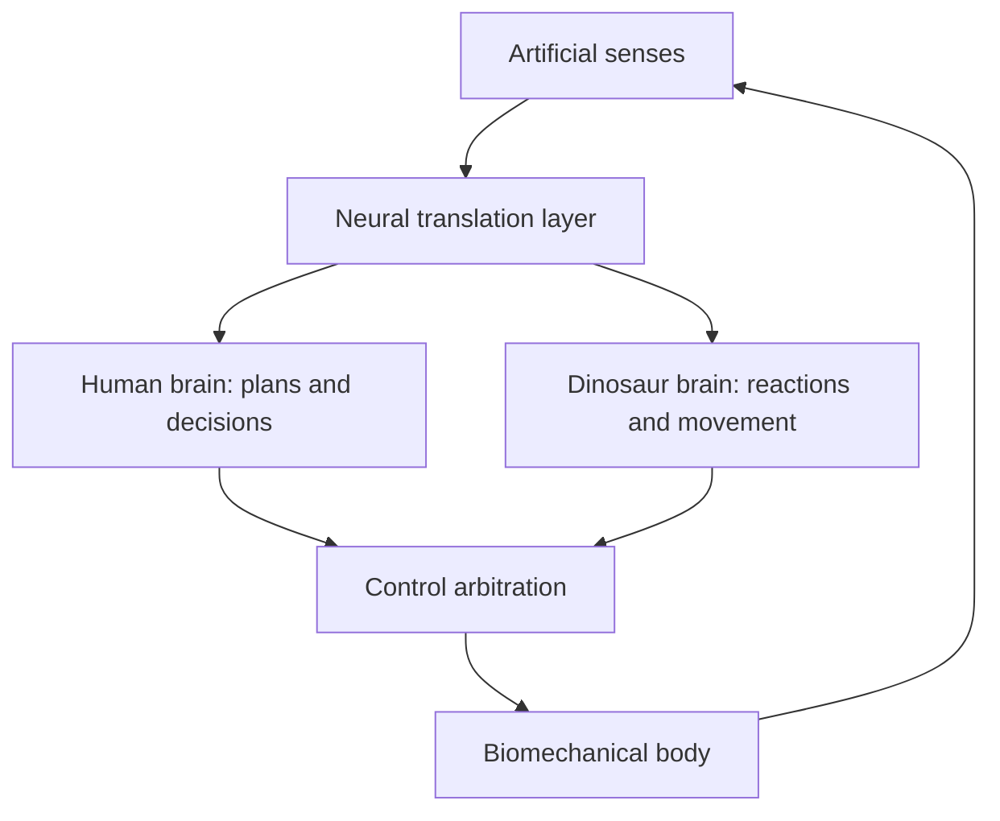

# Original Idea
Hybrid dinosaur/human cloning program that pairs a human and dinosaur brain together inside a singular bio-mech suit.

## 1. Capture the Idea

The strongest coherent version is:

> Reconstruct or genetically create a dinosaur-derived brain, connect it bidirectionally with a human brain, and place both inside one life-supported biomechanical body. The human supplies abstract reasoning and deliberate control, while the dinosaur brain contributes rapid sensorimotor processing, instincts, and control suited to a powerful animal-like frame.

The idea actually bundles together four enormous projects:

1. Dinosaur reconstruction or cloning.
2. Human cloning or preservation of a living human brain.
3. Functional communication between two radically different brains.
4. A biomechanical body capable of keeping both brains alive and translating their activity into coordinated movement.

The unusual part is not merely “a dinosaur cyborg.” It is the proposed **division of cognition between two biological controllers sharing one body**.

Important ambiguities:

- Is “dinosaur” a genuine cloned non-avian dinosaur or an engineered bird/reptile proxy?
- Are the brains entire conscious organs, neural tissue, or only genetically inspired control circuits?
- Does the human retain a normal body inside the suit, or are both brains disembodied?
- Is the dinosaur brain a conscious partner, an involuntary reflex system, or effectively a biological coprocessor?
- Who controls the body when the brains disagree?

Those distinctions radically change the plausibility.

---

## 2. Decompose It

### Observations and known facts

- Animal cloning through somatic-cell nuclear transfer is real. It works by transferring an intact donor-cell nucleus into an enucleated egg—not by constructing an animal from arbitrary fossil fragments. [FDA overview of cloning](https://www.fda.gov/vaccines-blood-biologics/cellular-gene-therapy-products/therapeutic-cloning-and-genome-modification)
- Human brains can control computers, robotic limbs, wheelchairs, and other devices through brain–computer interfaces.
- Limited information has been transmitted between human brains experimentally, but this is nothing like merging thoughts or creating a shared consciousness. One early human demonstration transmitted a simple motor command using EEG and magnetic stimulation. [Direct human brain-to-brain interface](https://pmc.ncbi.nlm.nih.gov/articles/PMC4221017/)
- Cultured neurons can interact adaptively with simulated environments. DishBrain, for example, connected neural cultures to a simplified Pong environment. [Neuron study](https://www.cell.com/neuron/fulltext/S0896-6273%2822%2900806-6)
- Biological tissue can power or control small machines. Researchers have built cultured-muscle biohybrid robots and electrically controlled neuromuscular machines. [Biohybrid bipedal robot](https://www.cell.com/matter/fulltext/s2590-2385%2823%2900648-3), [neuromuscular robot](https://www.science.org/doi/10.1126/scirobotics.ado0051)
- Human cortical organoids transplanted into rats have matured, received sensory input, grown connections, and influenced behavior. That proves cross-species neural integration is biologically possible at a limited tissue level. [Nature study](https://www.nature.com/articles/s41586-022-05277-w)

### Assumptions

The proposal requires all of the following:

- Recovering or accurately reconstructing a dinosaur genome.
- Growing a functional dinosaur brain without necessarily growing the corresponding animal.
- Knowing which neural signals mean what in an extinct species.
- Keeping an isolated brain alive indefinitely.
- Giving that brain meaningful artificial senses.
- Teaching two different brains to share actuators.
- Preventing neurological conflict, distress, seizures, immune rejection, and tissue degeneration.
- Building a body whose mass, power supply, cooling, balance, and strength outperform conventional robotics.

### Proposed mechanism

The implied architecture appears to be:

That translation-and-arbitration layer is not a minor component. It is the heart of the entire proposal.

### Speculation

- Dinosaur cognition would contribute something useful that cannot be obtained more easily with software.
- Dinosaur motor instincts would transfer to an artificial body.
- Two brains would cooperate rather than interfere.
- Biological neural tissue would be preferable to artificial control hardware.
- A dinosaur brain could develop normally without a dinosaur body and developmental environment.

None of these follows automatically from the established precedents.

---

## 3. Does This Already Exist?

### Dinosaur reconstruction: partial precedent

De-extinction, genome editing of living relatives, ancestral-genome reconstruction, and attempts to produce dinosaur-like traits in birds are existing ideas. Scientists have computationally inferred aspects of ancestral diapsid chromosome structure from living birds, reptiles, and turtles, but that is profoundly different from recovering a dinosaur genome. [Ancestral diapsid genome reconstruction](https://www.nature.com/articles/s41467-018-04267-9)

### Dual biological control: close relative

Brain-to-brain interfaces, neural grafts, biological neural networks controlling machines, and shared human–machine control are close relatives. None is currently close to linking two complete brains into one coordinated cognitive and motor system.

### Biomechanical body: close relative

Neuroprosthetics, powered exoskeletons, soft robots, cultured-muscle robots, cyborg animals, and biomechanical science fiction all overlap with the suit.

### Fictional precedent

The general imagery has strong precedents:

- *Jurassic Park*: dinosaur genetic reconstruction.
- *Pacific Rim*: two nervous systems sharing control of one machine.
- *Neon Genesis Evangelion*: human pilots neurally synchronized with biomechanical organisms.
- *Zoids* and other dinosaur-mecha fiction: animal-shaped biomechanical machines.

I did not identify a definitive direct match for the exact combination of a cloned human brain and cloned dinosaur brain jointly inhabiting one suit. However, the constituent ideas and much of the conceptual territory are already heavily represented.

**Precedent verdict: Partial Precedent**, bordering on **Close Relative** as a science-fiction concept.

---

## 4. Would It Actually Work?

### First break: there is nothing available to clone

Non-avian dinosaurs disappeared approximately 66 million years ago. The oldest authenticated environmental DNA recovered so far is about two million years old—and consists of degraded environmental fragments, not viable cells or complete chromosomes. [Two-million-year-old DNA study](https://www.nature.com/articles/s41586-022-05453-y)

Measurements of DNA decay in bone produced an estimated 521-year half-life for a particular 242-base-pair mitochondrial sequence under the studied conditions. This is not a universal expiration date, but it demonstrates why intact dinosaur genomes or nuclei are not expected to survive tens of millions of years. [DNA-decay study](https://royalsocietypublishing.org/rspb/article/279/1748/4724/74417/The-half-life-of-DNA-in-bone-measuring-decay)

Cloning requires an intact nucleus or viable cellular material. Fossil anatomy, partial proteins, and evolutionary comparisons cannot supply the exact sequence, chromosome organization, epigenetic state, egg chemistry, and embryonic developmental process.

At best, scientists might someday create a **dinosaur-inspired engineered bird or reptile**. That would be a new proxy organism, not a cloned dinosaur.

### Second break: cloning does not copy a mind

Even if a human were cloned, the clone would not possess the donor’s memories, learned abilities, identity, or personality. It would be a genetically similar new individual whose brain would have to develop through an entire childhood.

The same applies to a dinosaur. Producing genetically dinosaur-like neural tissue would not manufacture a fully trained dinosaur mind.

### Third break: a brain is not a detachable control module

Brains develop in continuous interaction with:

- A particular body
- Sensory organs
- Muscles and joints
- Hormonal systems
- Vestibular balance
- Internal-organ signals
- Early-life experience

A dinosaur’s neural circuits would have evolved to control its own muscles, posture, tail, eyes, inner ears, and spinal cord. Connecting the brain to a mechanical dinosaur-shaped frame would not automatically make the frame intelligible to it.

Both brains would have to learn the suit as a completely new body.

### Fourth break: two brains do not naturally add their abilities together

Connecting neurons does not automatically produce cooperation. A usable system needs to answer:

- Which brain owns each limb?
- Can either brain veto the other?
- What happens when one initiates attack and the other retreats?
- Which brain receives pain and damage signals?
- Does each brain receive the same visual field?
- Can the dinosaur side induce panic or aggression in the human?
- How is credit assigned when an action succeeds or fails?

Current brain-to-brain interfaces exchange extremely narrow signals. They do not translate concepts between species or reconcile competing intentions.

### Fifth break: life support is harder than the robot

An isolated complete brain requires continuous oxygenated blood flow, glucose, temperature regulation, waste removal, pressure control, hormonal support, infection prevention, and protection from mechanical shock.

Two different brains may also require different physiological conditions. If each needs its own circulation and endocrine support, the “suit” becomes two intensive-care systems wrapped around a robot.

### Sixth break: there is no clear advantage

The dinosaur brain is assumed to offer superior instincts or reflexes. But the relevant functions could probably be implemented more safely with:

- Conventional control software
- Reinforcement learning
- A synthetic spinal controller
- Neuromorphic hardware
- A living neural culture designed for a narrow task

A real animal brain brings hunger, fear, distress, sleep requirements, unpredictable learning, possible consciousness, and severe ethical problems. Unless it provides a capability machines cannot reproduce, it is an expensive liability.

---

## 5. The Actually Interesting Part

The strongest component is **heterogeneous biological shared control**:

> Could two neural systems with different strengths learn to divide control of one artificial body?

That is a legitimate research question even after removing dinosaurs and cloning.

A hierarchical arrangement could be useful:

- Human brain: goals, judgment, planning, authorization.
- Secondary controller: balance, gait, collision avoidance, rapid reactions.
- Arbitration layer: resolves conflicts and enforces safety constraints.
- Shared sensory feedback: lets both controllers adapt to the body.

Robotics already uses essentially this hierarchy, except the lower controller is software. Replacing it with a cultured biological neural network is scientifically questionable but testable.

Another interesting issue is whether a second adaptive neural controller would begin to develop its own body model and whether the human operator would perceive it as a tool, autonomous partner, or intrusive agency.

---

## 6. Try to Kill It

The strongest objection is not merely that dinosaur DNA is missing:

> **The dinosaur brain provides no demonstrated capability that justifies creating, sustaining, decoding, and negotiating with a second potentially conscious organism.**

Even granting miraculous dinosaur reconstruction, the proposal still needs to outperform an ordinary human–AI–robotic control system.

If software can supply balance, predator-like tracking, rapid reactions, gait control, and autonomous defense more reliably, the biological dinosaur brain has no functional reason to exist.

**Does the original idea survive?**

- As a practical engineering proposal: **No.**
- As speculative fiction: **Yes.**
- As inspiration for experiments in multi-controller embodiment: **Yes, after substantial modification.**

---

## 7. Try to Rescue It

The smallest defensible modification is:

> Replace the cloned dinosaur brain with a small, non-conscious cultured neural network trained as an adaptive sensorimotor controller, while a human uses a brain–computer interface to provide high-level commands to a robotic or biohybrid body.

The dinosaur aspect could remain as morphology and control inspiration:

- Bird/reptile locomotion data
- Dinosaur biomechanical reconstructions
- A tail-assisted balancing system
- Predator-inspired visual tracking
- Artificial spinal and cerebellar circuits
- A robotic theropod body plan

This becomes a **human-supervised dinosaur-inspired biohybrid robot**, not a human–dinosaur mind fusion.

A still more practical version would eliminate living neural tissue entirely:

> Human pilot + adaptive AI copilot + dinosaur-shaped biomechanical robot.

That preserves nearly every operational advantage while avoiding cloning, brain maintenance, interspecies communication, and most of the ethical disaster.

---

## 8. What Would Prove It?

The best first test requires no cloning or wet biology.

Build a simulation containing:

1. A dinosaur-shaped robot with unstable locomotion.
2. A human issuing high-level navigation commands.
3. A separate adaptive controller managing gait and reflexes.
4. An arbitration system controlling which commands take priority.
5. Conditions where the two controllers receive conflicting objectives.

Compare it against:

- Human-only control
- AI-only control
- Conventional hierarchical shared control
- The proposed adaptive dual-controller system

Measure:

- Falls
- Response time
- Energy use
- Task completion
- Human workload
- Control conflicts
- Adaptation after body damage

The idea fails its first practical test if the additional controller does not outperform conventional shared-control software.

Only if a biological neural controller demonstrated a repeatable advantage would organoid or cultured-neuron experiments be justified.

---

# Final Reality Check

**The Idea:**  
Clone or reconstruct human and dinosaur brains, connect them as cooperating controllers, and sustain them inside a single biomechanical body.

**Closest Existing Concept:**  
A combination of brain–computer interfaces, experimental brain-to-brain communication, biohybrid robotics, cross-species neural grafts, de-extinction proposals, and fictional dual-pilot biomecha.

**What’s Already Known:**  
Brains can control machines; limited neural information can cross an engineered interface; transplanted neural tissue can integrate with animal circuits; living muscles and neurons can participate in robotic systems.

**What’s Actually Interesting:**  
Whether two differently specialized adaptive controllers could develop a stable division of labor and a shared model of one artificial body.

**What Breaks:**  
There is no recoverable dinosaur nucleus or genome to clone. More fundamentally, brains are developmentally embodied systems—not interchangeable processors—and no mechanism exists for translating and arbitrating the intentions of two complete, radically different brains.

**The Rescue:**  
Use a human BCI for strategic intent and either a cultured non-conscious neural network or conventional AI for low-level control of a dinosaur-inspired robotic body.

**Best Next Test:**  
Simulate shared control of a dinosaur-shaped robot and determine whether a second adaptive controller beats ordinary hierarchical robotics without increasing conflicts or operator workload.

**Classification:** **FLAWED**, with **SPECULATIVE** and **INTERESTING** secondary components.

**Potential:** **Low** for the literal cloning program; **Moderate** for the rescued shared-control research concept.

The literal proposal collapses at dinosaur reconstruction and remains unjustified even if that problem is granted away. Its worthwhile core is not the cloned dinosaur—it is the problem of two adaptive agents learning to inhabit one body.
